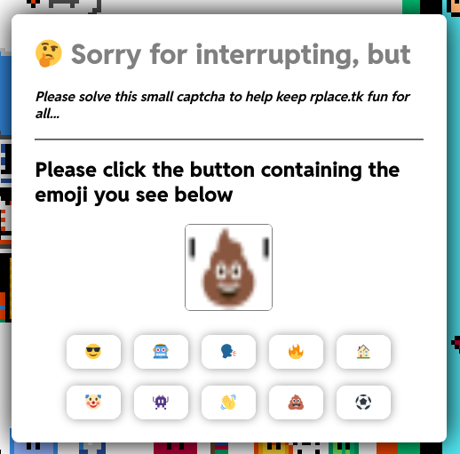

# zcaptcha
The rplace.tk server software edition of a collection of a few small javascript captchas for rplace.tk

Requirements:
- Latest version of Node.js
- websocket node module (provided in repo)
- imagemagick node module (provided in repo)
- a functioning web browser to test the demo (index.html + node server.js)
- ImageMagick and Pango (including anything related like libpango, etc) (not tested)
- (Optional) Install the noto color emoji font systemwide as root and regular user, in order to generate good looking with emojicaptcha

